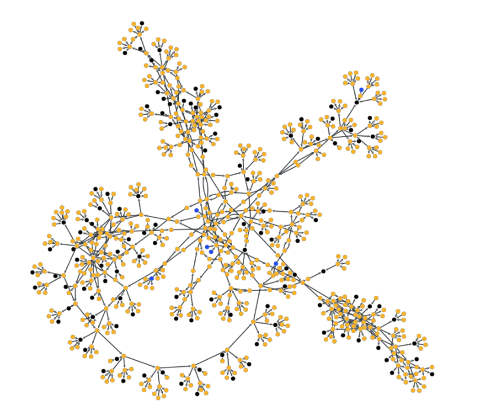
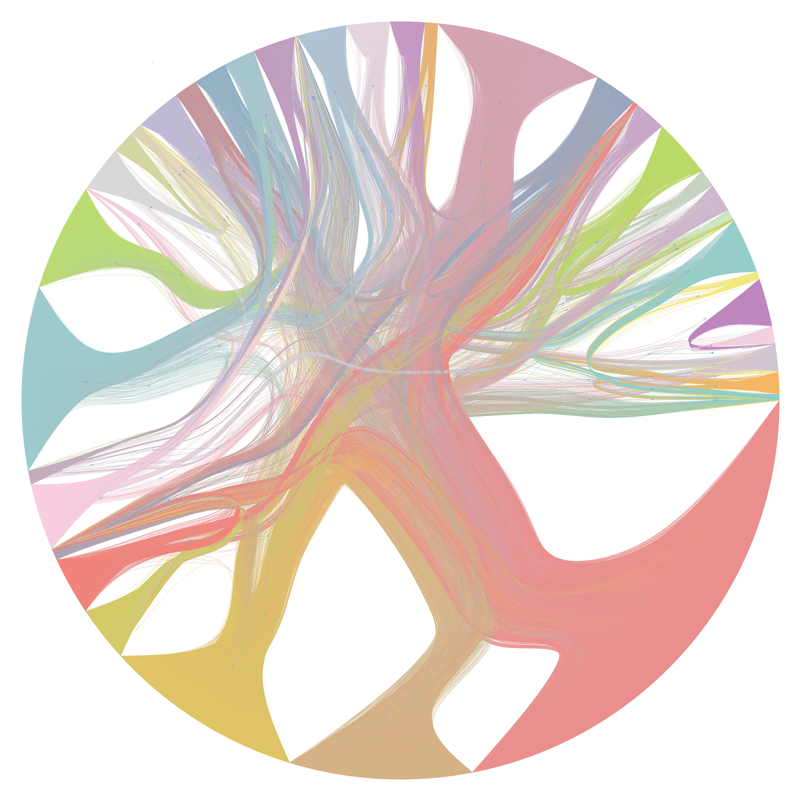

---
title:
output:
  revealjs::revealjs_presentation:
    self_contained: false
    center: false
    theme: simple
    transition: slide
    css: styles.css
---

```{r bg, echo=FALSE}
library(particlesjs)
particles(target_id = "cover")
```

<section class="present">
<h1 class="title"> Large Scale Graph Analytics </h1>
<h2 class="author"> Timothy Lin </h2>
<h3 class="date">4 March 2020 </h3>
<div id="cover"/>
</section>

```{r setup, include=FALSE}
knitr::opts_chunk$set(echo = FALSE)
```

# Motivation

<small>Source: https://xrpcommunity.blog/the-full-xrp-ledger-visualized/ (1.4m nodes, 2.6m edges) </small>

## __Challenges of Applied Graph Analytics__

- Very large graphs, millions of nodes & edges
  * Sampling? (whole is more than the sum of its parts)
  * Generating 'summary statistics' is also a challenge
  * How do we visualize?
- Multi-dimensional 
  * numerous vertex and edge attributes
  * time dimension
  * uncertainity / data quality issues
- Scalability
- Resouce constraints (unless we are Google)
- Most db systems do not support graph operations

# Problem Overview

<small>Source: Cylynx - node propagation and decay on a transaction graph </small>

## __Node Propagation on Transactional Graphs__

- Use cases:

  * [Community detection via label propagation](https://en.wikipedia.org/wiki/Label_propagation_algorithm)
  * Precomputing relations between entities
  * Semi-supervised tagging

## __Dataset__

- Sparse transaction graph (100m nodes, 300m edges and growing)
- Heavily skewed degree distribution (<10% of the nodes are invovled in 80% of the transactions)
- Time order matters!

## __Sample Dataset__

__Vertices__

| vertex_uid | attr1 | attr2 | attr3 |
|------------|-------|-------|-------|
| se2bhd3s   | 1     | 0     | 0     |
| 3fs34rfs   | 0     | 1     | 0     |
| 3x6hk6qw   | 0     | 0     | 1     |

__Edges__

| txn_uid | from     | to       | value | timestamp   |
|---------|----------|----------|-------|-------------|
| ASDJASD | se2bhd3s | 3fs34rfs | 10    | 11 Nov 2019 |
| ASDAECD | 3fs34rfs | 3x6hk6qw | 20    | 12 Dec 2020 |
| ESFDSGS | se2bhd3s | 3ds4rask | 30    | 20 Oct 2021 |


## __Business Requirements__

- Solution needs to be scaled to 10-100x larger graphs
- Need exact information on all the nodes / edges to be calculated
- Should be fast enough to try out different parameters and settings across the entire dataset
- Incremental updates should be fast
- Minimize cost (ok that's my requirement)

# Approach

<small>Source: Cylynx - loop de loop, visualizing paths between random start and end points of a mixer component </small>

## __Timeline__

1) Let's parallelize it with Spark!
2) Dump everything into a graph library!
3) Let's use a more efficient graph library!
4) How about a simple loop?
5) Let's add a little magic to the loop

__Our current solution is at least 10x faster and 10x cheaper than the initial one__

## __Naive Implementation__

- Use spark / graphframe to implement parallel processing
- Guarantees scalability right?
- But, at what cost?

__Lesson learnt:__ Use the right tools for the right job

## __Graph Library (Networkx)__

_Pros_

- Nice api
- Visualization
- Easy to compute summary statistics
- Documentation

_Limitation_

- Very slow 
- Tricky to deal with time data
- Memory hog

__Takeaway:__ If you have a big data problem, skip networkx

## __Efficient Graph Library__

Check out my [repo](https://github.com/timlrx/graph-benchmarks) for more performant libraries.

_Pros_

- Nice api
- Visualization
- Easy to compute summary statistics

_Limitation_

- Still not fast enough for our problem (though much faster than networkx)
- Tricky to deal with time data
- Memory intensive 

__Takeaway:__ Think about the problem, then re-think

# Our Methodology

<small>Source: Cylynx - hierarchical partitions of a stochastic block model (drawn using graph-tool)</small>

## __Let's consider the problem in more detail__

>- For every transaction, we need to look up each vertex attribute
>- Do a calculation base on that attribute and other edge attribute
>- Store it back as a vertex attribute
>- Repeat.
>- Sounds familiar?
>- Hmm...Maybe we can get by with a simple loop

## __The Loop approach__

>- Let's use each tool for what it's best designed to do
>- 'Skip' the vertex table
>- Pre-merge vertex attributes to edges using our SQL system before looping
>- Pre-sort the data, 'stream' it and loop over it in time order

_Pros_

>- Very fast (remove 2 k/v lookups)
>- Lower memory footprint (no need to store txn information)

>- __Can we do even better?__

## Graph insights - degree distribution

<small>Source: Cylynx - degree distribution of transactions </small>

## Graph insights - markov property

<small>Source: Cylynx - what's the catch? </small>

## __The Loop approach v2__

>- No need to store all the data on memory
>- Slightly poorer performance but we can hold intermediate state in a k/v store
>- Leverage on the graph degree distribution findings 
>- Active accounts at t are more likely to be active in t+1
>- Let's use a LRU cache!

_Pros_

>- Fast
>- Negligible memory footprint
>- Cheap (substitute memory for ssd)

# Discussion

<small>Source: Cylynx - a few random components of our tagged transaction graph, visualized</small>

## __Takeaway__

- It's worth spending time to think through the problem carefully
- Personally, I would skip networkx and start exploring with a more performant graph library
- Leveraging on conventional SQL systems, with a small compute machine, we can do very impressive calculations
- Our solution is 10x faster and cheaper than our previous one
- Still further room to optimize but it's really unnecessary at this point

## __Ongoing Challenges__

- Visualization tools are still quite primitive for big graphs
  * How do we visualize large graphs meaningfully?
  * How can we allow efficient exploration of neighbourhoods?
- Distributed graph computing
- How do we do write tests on big graphs / monitor algorithm performance?
- How can we make graphDBs and graph computation software work seamlessly together?  

<div style="text-align: center; padding-top:50px;">__Thank you!__</div>

